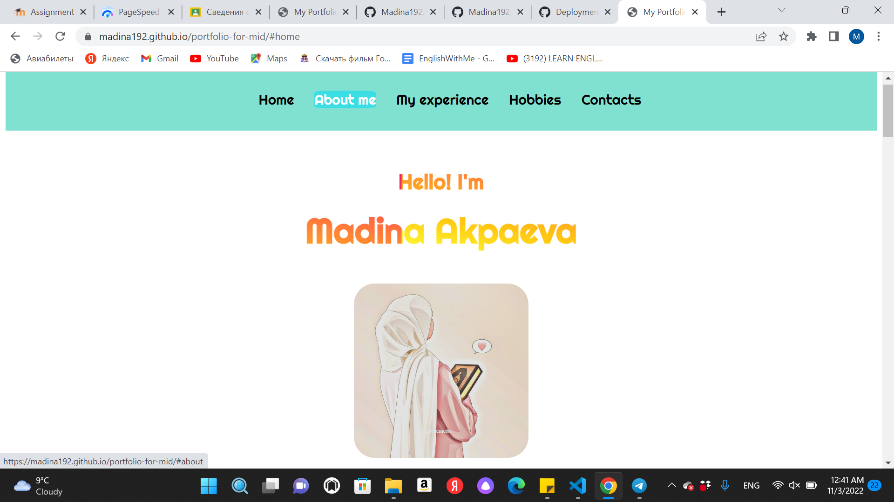

# https://madina192.github.io/portfolio-for-mid/
# I have done my portfolio by myself. I wrote the functions in JS, also used some libraries like JQuery, Fontawesome Icons. 
# Home Section

# Video Section
# You can watch an animated short films by clicking each of them:

# fetch API Section
# Here you need to click the "Get Users" button in order to get elements, when you click an another button "Delete all" appears, by clicking that you delete all of the elements"

# Interesting Section
# This section is the most interesting, there are links to the best books, films and online mind games. You can enjoy them if you are bored:

# Also you can read what about these books are:

# My Hobbies Section

# Contacts Section and Footer
# There are links to my email, telegram, Instagram if you want to contact me or just talk to me.
# In Footer the first link works, where there is phone icon. On smartphones by clicking you can get  my phone number to call me:

